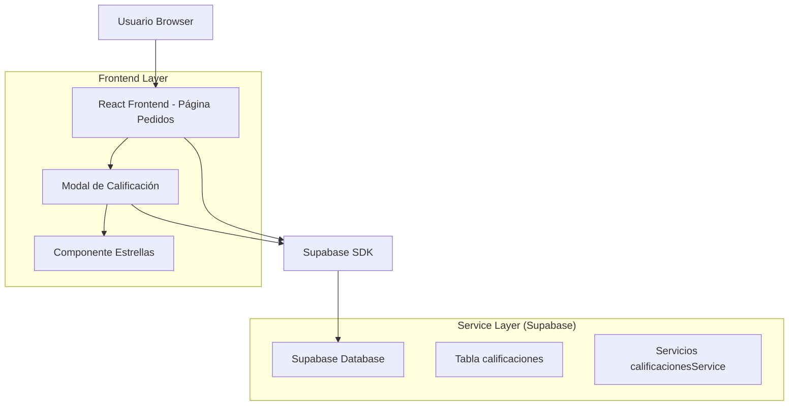
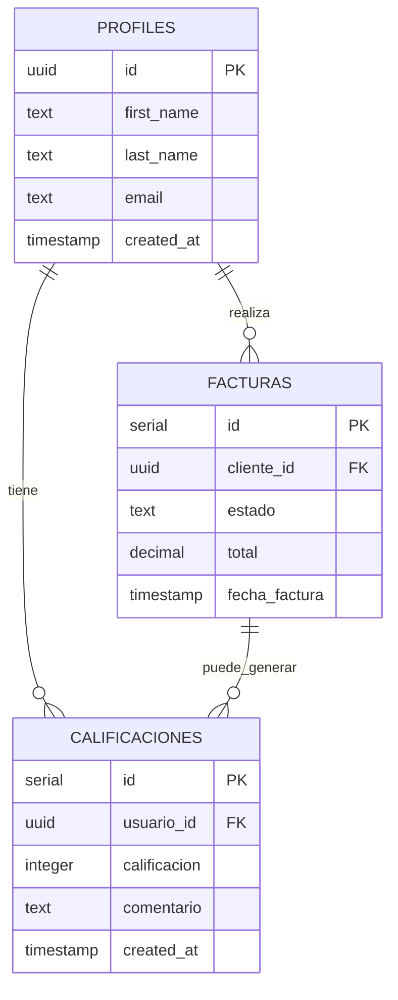

# Sistema de Calificaciones - Documento de Arquitectura Técnica

## 1. Diseño de Arquitectura



## 2. Descripción de Tecnología

- Frontend: React@18 + TypeScript + TailwindCSS@3 + Next.js
- Backend: Ninguno (Supabase maneja toda la lógica del servidor)
- Base de datos: Supabase PostgreSQL

## 3. Servicios de Datos

- Supabase: Almacenar datos de calificaciones de usuarios
- Tabla calificaciones: Nueva tabla para gestionar feedback de usuarios
- Servicios calificacionesService: CRUD operations para calificaciones

## 4. Modelo de Datos

### 4.1 Definición del Modelo de Datos



### 4.2 Lenguaje de Definición de Datos

#### Tabla de Calificaciones (calificaciones)

```sql
-- Crear tabla de calificaciones
CREATE TABLE calificaciones (
    id SERIAL PRIMARY KEY,
    usuario_id UUID REFERENCES profiles(id) ON DELETE CASCADE,
    calificacion INTEGER NOT NULL CHECK (calificacion >= 1 AND calificacion <= 5),
    comentario TEXT,
    created_at TIMESTAMP DEFAULT NOW(),
    updated_at TIMESTAMP DEFAULT NOW()
);

-- Crear índices para optimizar consultas
CREATE INDEX idx_calificaciones_usuario_id ON calificaciones(usuario_id);
CREATE INDEX idx_calificaciones_created_at ON calificaciones(created_at DESC);
CREATE INDEX idx_calificaciones_calificacion ON calificaciones(calificacion);

-- Habilitar realtime para la tabla
ALTER TABLE calificaciones ENABLE REALTIME;

-- Función para verificar si un usuario ya ha calificado
CREATE OR REPLACE FUNCTION usuario_ya_califico(p_usuario_id UUID)
RETURNS BOOLEAN AS $$
BEGIN
    RETURN EXISTS (
        SELECT 1 FROM calificaciones 
        WHERE usuario_id = p_usuario_id
    );
END;
$$ LANGUAGE plpgsql;

-- Función para verificar si es el primer pedido pagado del usuario
CREATE OR REPLACE FUNCTION es_primer_pedido_pagado(p_usuario_id UUID)
RETURNS BOOLEAN AS $$
DECLARE
    pedidos_pagados INTEGER;
BEGIN
    SELECT COUNT(*) INTO pedidos_pagados
    FROM facturas 
    WHERE cliente_id = p_usuario_id 
    AND estado = 'pagado';
    
    RETURN pedidos_pagados = 1;
END;
$$ LANGUAGE plpgsql;

-- Función para obtener estadísticas de calificaciones
CREATE OR REPLACE FUNCTION obtener_estadisticas_calificaciones()
RETURNS JSON AS $$
DECLARE
    resultado JSON;
BEGIN
    SELECT json_build_object(
        'total_calificaciones', COUNT(*),
        'promedio_calificacion', ROUND(AVG(calificacion), 2),
        'distribucion', json_build_object(
            'cinco_estrellas', COUNT(*) FILTER (WHERE calificacion = 5),
            'cuatro_estrellas', COUNT(*) FILTER (WHERE calificacion = 4),
            'tres_estrellas', COUNT(*) FILTER (WHERE calificacion = 3),
            'dos_estrellas', COUNT(*) FILTER (WHERE calificacion = 2),
            'una_estrella', COUNT(*) FILTER (WHERE calificacion = 1)
        )
    ) INTO resultado
    FROM calificaciones;
    
    RETURN resultado;
END;
$$ LANGUAGE plpgsql;

-- Datos iniciales (opcional)
-- No se insertan datos iniciales ya que las calificaciones son generadas por usuarios
```

#### Modificaciones a la tabla facturas (si es necesario)

```sql
-- Agregar trigger para notificar cuando una factura cambia a 'pagado'
CREATE OR REPLACE FUNCTION notificar_factura_pagada()
RETURNS TRIGGER AS $$
BEGIN
    -- Solo notificar si el estado cambió a 'pagado'
    IF OLD.estado != 'pagado' AND NEW.estado = 'pagado' THEN
        -- Aquí se podría agregar lógica adicional si es necesario
        -- Por ahora solo registramos el cambio
        RAISE NOTICE 'Factura % cambió a pagado para usuario %', NEW.numero_factura, NEW.cliente_id;
    END IF;
    
    RETURN NEW;
END;
$$ LANGUAGE plpgsql;

-- Crear trigger
CREATE TRIGGER trigger_factura_pagada
    AFTER UPDATE ON facturas
    FOR EACH ROW
    EXECUTE FUNCTION notificar_factura_pagada();
```

## 5. Definiciones de Tipos TypeScript

```typescript
// Interfaz para calificaciones
export interface Calificacion {
  id: number;
  usuario_id: string;
  calificacion: number; // 1-5
  comentario?: string;
  created_at: string;
  updated_at: string;
}

// Tipo para crear nueva calificación
export interface NuevaCalificacion {
  usuario_id: string;
  calificacion: number;
  comentario?: string;
}

// Tipo para estadísticas de calificaciones
export interface EstadisticasCalificaciones {
  total_calificaciones: number;
  promedio_calificacion: number;
  distribucion: {
    cinco_estrellas: number;
    cuatro_estrellas: number;
    tres_estrellas: number;
    dos_estrellas: number;
    una_estrella: number;
  };
}

// Servicios para calificaciones
export const calificacionesService = {
  // Crear nueva calificación
  async crear(calificacion: NuevaCalificacion): Promise<Calificacion> {
    const { data, error } = await supabase
      .from('calificaciones')
      .insert(calificacion)
      .select()
      .single();
    
    if (error) throw error;
    return data;
  },

  // Verificar si usuario ya calificó
  async usuarioYaCalifico(usuarioId: string): Promise<boolean> {
    const { data, error } = await supabase
      .rpc('usuario_ya_califico', { p_usuario_id: usuarioId });
    
    if (error) throw error;
    return data;
  },

  // Verificar si es primer pedido pagado
  async esPrimerPedidoPagado(usuarioId: string): Promise<boolean> {
    const { data, error } = await supabase
      .rpc('es_primer_pedido_pagado', { p_usuario_id: usuarioId });
    
    if (error) throw error;
    return data;
  },

  // Obtener calificaciones de un usuario
  async obtenerPorUsuario(usuarioId: string): Promise<Calificacion[]> {
    const { data, error } = await supabase
      .from('calificaciones')
      .select('*')
      .eq('usuario_id', usuarioId)
      .order('created_at', { ascending: false });
    
    if (error) throw error;
    return data || [];
  },

  // Obtener todas las calificaciones (para admin)
  async obtenerTodas(): Promise<Calificacion[]> {
    const { data, error } = await supabase
      .from('calificaciones')
      .select(`
        *,
        profiles:usuario_id (
          first_name,
          last_name,
          email
        )
      `)
      .order('created_at', { ascending: false });
    
    if (error) throw error;
    return data || [];
  },

  // Obtener estadísticas
  async obtenerEstadisticas(): Promise<EstadisticasCalificaciones> {
    const { data, error } = await supabase
      .rpc('obtener_estadisticas_calificaciones');
    
    if (error) throw error;
    return data;
  }
};
```

## 6. Componentes React Necesarios

### 6.1 Componente Modal de Calificación

```typescript
// components/ModalCalificacion.tsx
interface ModalCalificacionProps {
  isOpen: boolean;
  onClose: () => void;
  onSubmit: (calificacion: number, comentario: string) => void;
  loading?: boolean;
}
```

### 6.2 Componente Selector de Estrellas

```typescript
// components/SelectorEstrellas.tsx
interface SelectorEstrellasProps {
  calificacion: number;
  onChange: (calificacion: number) => void;
  readonly?: boolean;
  size?: 'sm' | 'md' | 'lg';
}
```

## 7. Flujo de Integración

1. **Modificar database.ts**: Agregar interfaces y servicios de calificaciones
2. **Actualizar database.txt**: Agregar DDL para tabla calificaciones y funciones
3. **Crear componentes**: ModalCalificacion y SelectorEstrellas
4. **Modificar page.tsx**: Integrar lógica de detección de primer pedido pagado
5. **Testing**: Verificar flujo completo de calificación

Esta arquitectura mantiene la simplicidad del sistema actual mientras agrega la funcionalidad de calificaciones de manera escalable y mantenible.