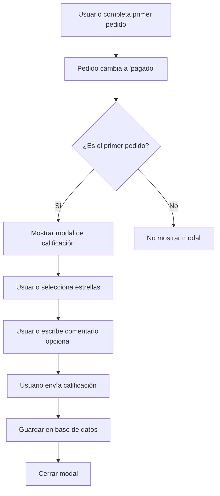

# Sistema de Calificaciones - Documento de Requerimientos del Producto

## 1. Resumen del Producto

Sistema de calificaciones para recopilar feedback de usuarios después de completar su primer pedido en la plataforma TastyFood. Permite a los usuarios calificar su experiencia con estrellas (1-5) y dejar comentarios opcionales.

## 2. Características Principales

### 2.1 Roles de Usuario

| Rol | Método de Registro | Permisos Principales |
|-----|-------------------|---------------------|
| Cliente | Registro por email | Puede calificar después de su primer pedido pagado |
| Administrador | Acceso directo | Puede ver todas las calificaciones y estadísticas |

### 2.2 Módulos de Funcionalidad

Nuestro sistema de calificaciones consta de las siguientes páginas principales:

1. **Página de Pedidos**: Modal de calificación, validación de primer pedido, envío de calificación.
2. **Base de Datos**: Nueva tabla de calificaciones, servicios de calificación.

### 2.3 Detalles de Página

| Nombre de Página | Nombre del Módulo | Descripción de Funcionalidad |
|------------------|-------------------|------------------------------|
| Página de Pedidos | Modal de Calificación | Mostrar modal automáticamente cuando el primer pedido del usuario cambie a estado 'pagado'. Incluye selector de estrellas (1-5) y campo de comentario opcional |
| Página de Pedidos | Validación de Primer Pedido | Verificar si es el primer pedido del usuario antes de mostrar el modal de calificación |
| Base de Datos | Tabla de Calificaciones | Almacenar calificaciones con usuario_id, calificación (1-5), comentario y fecha |
| Base de Datos | Servicios de Calificación | Crear, obtener y validar calificaciones de usuarios |

## 3. Proceso Principal

### Flujo de Calificación del Usuario

1. El usuario realiza su primer pedido
2. El pedido cambia a estado 'pagado'
3. El sistema verifica si es el primer pedido del usuario
4. Se muestra automáticamente el modal de calificación
5. El usuario selecciona estrellas (1-5) y opcionalmente escribe un comentario
6. El usuario envía la calificación
7. La calificación se guarda en la base de datos
8. El modal se cierra y no vuelve a aparecer para futuros pedidos

## 4. Diseño de Interfaz de Usuario

### 4.1 Estilo de Diseño

- **Colores primarios**: Azul (#2563eb) para botones principales, amarillo dorado (#fbbf24) para estrellas
- **Colores secundarios**: Gris (#6b7280) para texto secundario, verde (#10b981) para confirmación
- **Estilo de botones**: Redondeados con efecto hover
- **Fuente**: Sistema por defecto, tamaños 14px para texto normal, 18px para títulos
- **Estilo de layout**: Modal centrado con overlay semi-transparente
- **Iconos**: Estrellas sólidas y vacías para el sistema de calificación

### 4.2 Resumen de Diseño de Página

| Nombre de Página | Nombre del Módulo | Elementos de UI |
|------------------|-------------------|----------------|
| Página de Pedidos | Modal de Calificación | Modal centrado con fondo semi-transparente negro (bg-opacity-50), contenedor blanco redondeado, título "Califica tu experiencia", 5 estrellas interactivas doradas, textarea para comentarios, botones "Enviar" (azul) y "Omitir" (gris) |
| Página de Pedidos | Selector de Estrellas | 5 íconos de estrella en línea, color dorado cuando están seleccionadas, gris cuando están vacías, efecto hover para preview |
| Página de Pedidos | Campo de Comentario | Textarea con placeholder "Cuéntanos sobre tu experiencia (opcional)", borde redondeado, máximo 500 caracteres |

### 4.3 Responsividad

El modal está optimizado para dispositivos móviles con ancho máximo adaptativo y padding lateral en pantallas pequeñas. El diseño es mobile-first con interacciones táctiles optimizadas para la selección de estrellas.